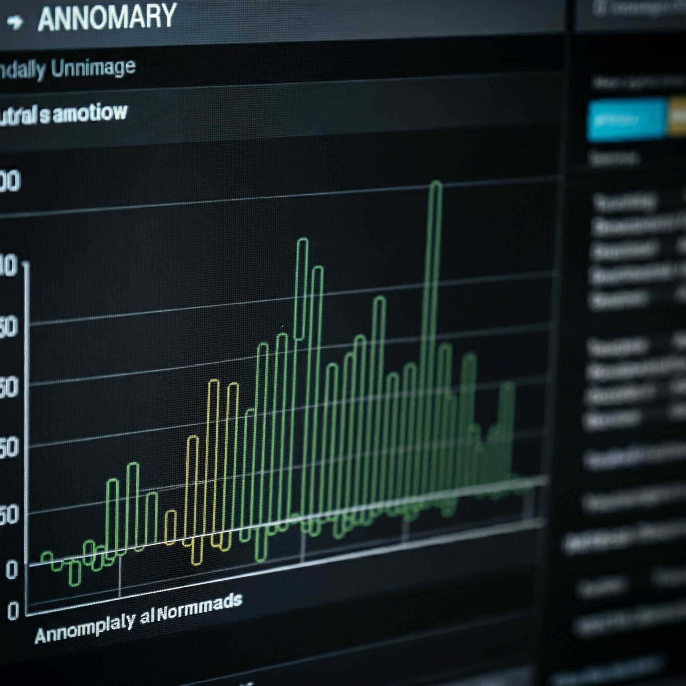

# Anomalizer v2.0

**[🇺🇸 English](README.md) | [🇷🇺 Русский](README.ru.md)**



## Project Description

> **🚀 Version 2.0** - Significant architecture improvements, extended testing, and optimized code

**Anomalizer** is a tool for time series analysis and anomaly detection using the Interquartile Range (IQR) method. The project is built using the Streamlit library to create an interactive web application that allows users to upload their data, configure analysis parameters, and visualize results.

You can explore the application functionality at [this link](https://anomalizer-d5nj5mqpuwsr8u6bxkxot9.streamlit.app/), and download test datasets from the `files_datasets` folder.

## 🆕 What's New in Version 2.0

- **🔧 Improved Architecture**: Code split into modular components for better maintainability
- **🧪 Extended Testing**: 23 tests cover all core functions and edge cases
- **📊 Enhanced Visualization**: Optimized charts with better performance
- **🛡️ Reliable Error Handling**: Proper handling of empty data and edge cases
- **📝 Complete Documentation**: All functions include detailed docstrings
- **🎯 Type Annotations**: Added type hints for better IDE support
- **⚡ PEP 8 Compliance**: Code aligned with Python standards

## Features

- **Data Upload**: Support for Excel file uploads
- **Column Selection**: Choose date column for X-axis and numeric column for analysis
- **Data Grouping**: Support for categorical features for data grouping
- **Threshold Configuration**: Configure lower and upper thresholds for anomaly detection
- **Visualization**: Interactive charts using Plotly for anomaly visualization
- **Results Download**: Download analysis results in Excel format
- **Column-wise Anomaly Search**: Search for anomalies in each dataset column with tabular results

## 🚀 Installation and Deployment

### System Requirements
- Python 3.8+
- 2+ GB free disk space
- 4+ GB RAM (recommended for large datasets)

### 📥 Repository Cloning

```bash
git clone https://github.com/yourusername/anomalizer.git
cd anomalizer
```

---

## 💻 OS-Specific Installation

### 🐧 Linux (Ubuntu/Debian)

#### Method 1: Using venv (recommended)
```bash
# Install Python and pip (if not installed)
sudo apt update
sudo apt install python3 python3-pip python3-venv

# Create virtual environment
python3 -m venv anomalizer-env

# Activate environment
source anomalizer-env/bin/activate

# Install dependencies
pip install -r requirements.txt

# Run application
streamlit run app5.py
```

#### Method 2: Using Anaconda/Miniconda
```bash
# Install Miniconda (if not installed)
wget https://repo.anaconda.com/miniconda/Miniconda3-latest-Linux-x86_64.sh
bash Miniconda3-latest-Linux-x86_64.sh

# Reload terminal or
source ~/.bashrc

# Create environment
conda create --name anomalizer-env python=3.9
conda activate anomalizer-env

# Install dependencies
pip install -r requirements.txt

# Run application
streamlit run app5.py
```

#### Method 3: System Installation
```bash
# Install dependencies globally (not recommended)
pip3 install -r requirements.txt

# Run application
streamlit run app5.py
```

---

### 🍎 macOS

#### Method 1: Using venv (recommended)
```bash
# Python usually pre-installed, if not:
# brew install python

# Create virtual environment
python3 -m venv anomalizer-env

# Activate environment
source anomalizer-env/bin/activate

# Install dependencies
pip install -r requirements.txt

# Run application
streamlit run app5.py
```

#### Method 2: Using Homebrew + venv
```bash
# Install Python via Homebrew
brew install python

# Create virtual environment
python3 -m venv anomalizer-env

# Activate environment
source anomalizer-env/bin/activate

# Install dependencies
pip install -r requirements.txt

# Run application
streamlit run app5.py
```

#### Method 3: Using Anaconda/Miniconda
```bash
# Install Miniconda (if not installed)
curl -O https://repo.anaconda.com/miniconda/Miniconda3-latest-MacOSX-x86_64.sh
bash Miniconda3-latest-MacOSX-x86_64.sh

# Reload terminal
source ~/.zshrc  # or source ~/.bash_profile

# Create environment
conda create --name anomalizer-env python=3.9
conda activate anomalizer-env

# Install dependencies
pip install -r requirements.txt

# Run application
streamlit run app5.py
```

---

### 🪟 Windows

#### Method 1: Using venv (recommended)
```cmd
# Install Python from python.org (if not installed)
# Download from https://www.python.org/downloads/

# Create virtual environment
python -m venv anomalizer-env

# Activate environment
anomalizer-env\Scripts\activate

# Install dependencies
pip install -r requirements.txt

# Run application
streamlit run app5.py
```

#### Method 2: Using Anaconda/Miniconda
```cmd
# Install Anaconda/Miniconda from official website
# https://www.anaconda.com/products/distribution

# Create environment
conda create --name anomalizer-env python=3.9
conda activate anomalizer-env

# Install dependencies
pip install -r requirements.txt

# Run application
streamlit run app5.py
```

#### Method 3: PowerShell
```powershell
# Create virtual environment
python -m venv anomalizer-env

# Activate environment
.\anomalizer-env\Scripts\Activate.ps1

# If ExecutionPolicy error occurs:
Set-ExecutionPolicy -ExecutionPolicy RemoteSigned -Scope CurrentUser

# Install dependencies
pip install -r requirements.txt

# Run application
streamlit run app5.py
```

---

## 🐳 Docker Deployment

### Quick Docker Start

```bash
# Build image
docker build -t anomalizer:2.0 .

# Run container
docker run -p 8505:8505 anomalizer:2.0
```

### Docker Compose (recommended for production)

Create `docker-compose.yml` file:

```yaml
version: '3.8'
services:
  anomalizer:
    build: .
    ports:
      - "8505:8505"
    volumes:
      - ./files_datasets:/app/files_datasets
    environment:
      - STREAMLIT_SERVER_HEADLESS=true
      - STREAMLIT_SERVER_ENABLE_CORS=false
    restart: unless-stopped
```

Launch:
```bash
docker-compose up -d
```

### Pre-built Image from Docker Hub (if available)
```bash
# Download and run pre-built image
docker pull mih10/anomalizer:2.0
docker run -p 8505:8505 mih10/anomalizer:2.0
```

---

## 🔧 Additional Commands

### Deactivate Virtual Environment
```bash
# For venv
deactivate

# For conda
conda deactivate
```

### Remove Environment
```bash
# For venv
rm -rf anomalizer-env  # Linux/macOS
rmdir /s anomalizer-env  # Windows

# For conda
conda env remove --name anomalizer-env
```

### Update Dependencies
```bash
pip install --upgrade -r requirements.txt
```

## 📱 Usage

### Local Launch
```bash
# After installation and environment activation
streamlit run app5.py
```

### Docker Launch
```bash
# Quick launch
docker-compose up

# Production with nginx
docker-compose --profile production up -d
```

### Application Access
- **Local**: http://localhost:8501
- **Docker**: http://localhost:8505
- **Docker with nginx**: http://localhost:80

### Step-by-Step Usage
1. 📁 **Upload Excel file** with your data
2. 📊 **Select columns** for analysis (date, numeric data)
3. 🏷️ **Configure grouping** (optional)
4. ⚙️ **Set thresholds** for anomaly detection
5. 🔍 **Run analysis** by clicking the appropriate button
6. 📈 **View results** and interactive charts
7. 💾 **Download report** in Excel format

## Usage Examples

### Example 1: Time Series Analysis

1. Upload an Excel file with time series data.
2. Select a date column for the X-axis and a numeric column for analysis.
3. Choose categorical features for data grouping.
4. Configure lower and upper thresholds for anomaly detection.
5. Click "Detect Anomalies" button.
6. Review results and visualization.


### Example 2: Categorical Data Analysis

1. Upload an Excel file containing categorical features.
2. Select a date column for the X-axis (if available) and a numeric column for analysis.
3. Click "Process file and find anomalies for each column" button.
4. Review results.


## Business Benefits

**Anomalizer** is a versatile tool that helps find anomalies in any data, whether financial, logistical, or physical metrics transmitted from industrial sensors. Anomaly detection can help with:

- **Cost Reduction**: Detecting and eliminating anomalies can prevent financial losses.
- **Efficiency Improvement**: Identifying problem areas allows for process optimization.
- **Data Quality Enhancement**: Detecting and correcting anomalies improves data accuracy and reliability.
- **Informed Decision Making**: Analyzing data without anomalies enables more accurate and informed decisions.

## Documentation

### Interquartile Range (IQR) Method for Outlier Detection

The Interquartile Range (IQR) is a statistical measure of data spread used to identify outliers in datasets. This method is robust against extreme values and effective for asymmetric distributions.

#### Method Steps:

1. **Data Sorting**
   - Order all values in ascending order.

2. **Finding Quartiles**
   - Q1 (first quartile): 25th percentile
   - Q2 (median): 50th percentile
   - Q3 (third quartile): 75th percentile

3. **Calculate Interquartile Range (IQR)**
   - IQR = Q3 - Q1

4. **Define Outlier Boundaries**
   - Lower boundary = Q1 - (multiplier * IQR)
   - Upper boundary = Q3 + (multiplier * IQR)
   - Standard multiplier: 1.5

5. **Identify Outliers**
   - Any values outside these boundaries are considered outliers.

#### Apple Example

Imagine we have the following weights of 20 apples (in grams), already sorted in ascending order:
82, 85, 88, 90, 92, 95, 98, 100, 103, 105, 108, 110, 112, 115, 118, 120, 123, 125, 128, 130

Now let's calculate:

1. Divide our apples into 4 groups (5 apples each):
   - Group 1: 82, 85, 88, 90, 92
   - Group 2: 95, 98, 100, 103, 105
   - Group 3: 108, 110, 112, 115, 118
   - Group 4: 120, 123, 125, 128, 130

2. Determine Q1 and Q3 values:
   - Q1 (boundary between 1st and 2nd group) = 92g
   - Q3 (boundary between 3rd and 4th group) = 120g

3. Calculate interquartile range:
   - Interquartile range = Q3 - Q1 = 120g - 92g = 28g

Thus, the interquartile range for our apple set is 28 grams. This means the weight difference between 25% and 75% of our apples (the "middle" 50% of apples) is 28 grams. This indicator gives us an idea of the weight spread of most apples, excluding the lightest and heaviest ones that could distort the overall picture.

#### IQR Multiplier Impact

- Increasing the multiplier makes the method less sensitive (fewer values identified as outliers).
- Decreasing the multiplier makes the method more sensitive (more values identified as outliers).

The multiplier choice depends on data specifics and analysis goals. The standard value of 1.5 suits many cases but can be adjusted based on required anomaly detection strictness.

This method is effective for primary data analysis and potential anomaly identification, but data context should be considered when interpreting results.

## 🛠️ Troubleshooting

### Common Issues

#### Installation Problems
```bash
# Error: ModuleNotFoundError
pip install --upgrade pip
pip install -r requirements.txt

# Permission errors (Linux/macOS)
sudo pip install -r requirements.txt
# or
pip install --user -r requirements.txt
```

#### Streamlit Issues
```bash
# Port already in use
streamlit run app5.py --server.port 8502

# Cache problems
streamlit cache clear
```

#### Docker Problems
```bash
# Permission issues (Linux)
sudo docker-compose up

# Clean containers
docker-compose down
docker system prune -a
```

#### Excel File Issues
- Ensure file is not open in another application
- Check file encoding (should be UTF-8)
- File size should not exceed 200 MB

### Data Requirements
- **File format**: Excel (.xlsx, .xls)
- **Structure**: Data should be in tabular format
- **Columns**: At least one numeric column for analysis
- **Rows**: Minimum 10 records for proper analysis

### Support
- 📧 Email: support@anomalizer.com
- 🐛 Issues: [GitHub Issues](https://github.com/yourusername/anomalizer/issues)
- 📖 Documentation: [Wiki](https://github.com/yourusername/anomalizer/wiki)

---

## 📊 System Requirements

| Component | Minimum | Recommended |
|-----------|---------|-------------|
| **Python** | 3.8+ | 3.9+ |
| **RAM** | 2 GB | 4+ GB |
| **Disk** | 1 GB | 2+ GB |
| **CPU** | 1 core | 2+ cores |
| **OS** | Windows 10, macOS 10.14, Ubuntu 18.04 | Latest versions |

---

## 🧪 Testing

```bash
# Run all tests
pytest

# Run with coverage
pytest --cov=. --cov-report=html

# Run specific test
pytest tests/test_anomaly_detection.py -v
```

---

## 🤝 Contributing

1. Fork the repository
2. Create feature branch (`git checkout -b feature/amazing-feature`)
3. Commit changes (`git commit -m 'Add amazing feature'`)
4. Push to branch (`git push origin feature/amazing-feature`)
5. Open Pull Request

---

## 📈 Performance

### Recommended Data Sizes
- **Small files**: up to 1000 rows - instant processing
- **Medium files**: 1K-10K rows - up to 5 seconds
- **Large files**: 10K-100K rows - up to 30 seconds
- **Very large files**: 100K+ rows - may require optimization

### Optimization
```python
# For large files use chunked reading
df = pd.read_excel('large_file.xlsx', chunksize=1000)
```

---

## 📝 Version History

### v2.0.0 (Current)
- 🔧 Complete architecture refactoring
- 🧪 Added 23 tests
- 📊 Enhanced visualization
- 🛡️ Reliable error handling
- 📝 Complete documentation

### v1.0.0
- ✨ First release
- 📊 Basic anomaly detection functionality
- 🎨 Simple Streamlit interface

---

## License

This project is licensed under the GNU General Public License v3.0. See the [LICENSE](LICENSE) file for details.